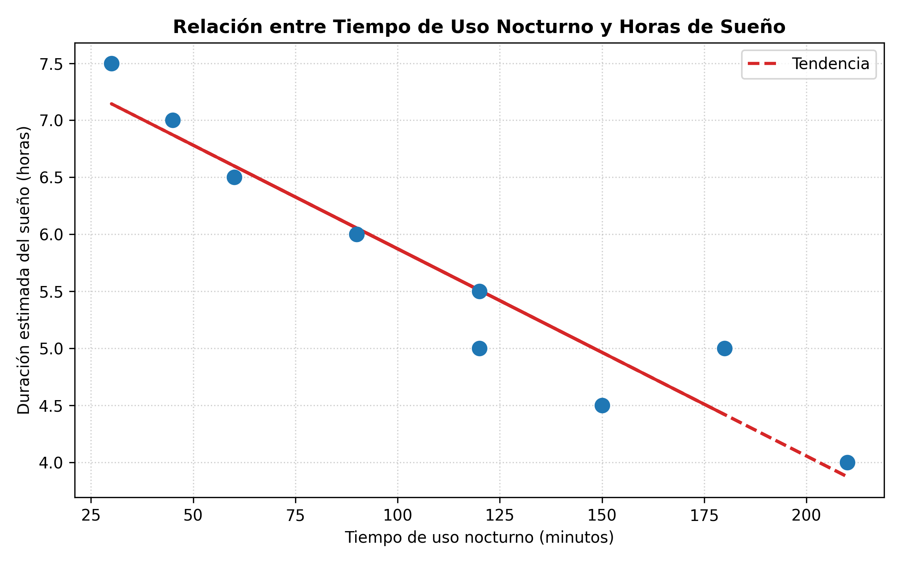
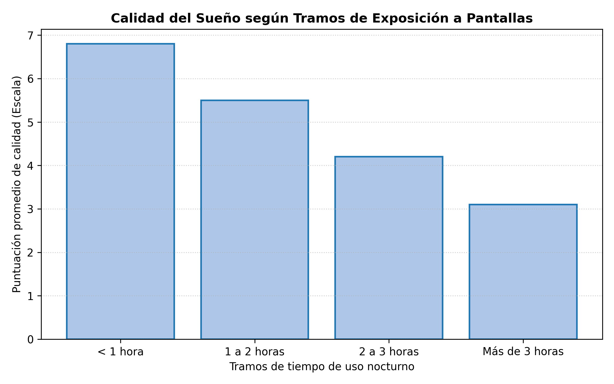

  <h3>UNIVERSIDAD CENTRAL DE VENEZUELA</h3>
  
FACULTAD DE CIENCIAS ECONÓMICAS Y SOCIALES 
  ESCUELA DE ESTADÍSTICA Y CIENCIAS ACTUARIALES 
  DEPARTAMENTO DE INFORMÁTICA 
  COMPUTACIÓN ESTADÍSTICA

  
  
SEMESTRE 2026-01S

  
   
  
  <h1>EL IMPACTO DEL USO DE DISPOSITIVOS ELECTRÓNICOS EN LA CALIDAD DEL SUEÑO DE ESTUDIANTES DE LA EECA-UCV DURANTE EL PERÍODO 2026-01S</h1>

**Estudiantes:** 
* Armando Delfín, C.I: 30.330.804  
* Giovanni Fermín, C.I: 31.112.857  
* Anaís Moncada, C.I: 26.152.765

**Profesora:** Oriana Medina

  
Caracas, Septiembre 2026

---

## ÍNDICE
1. Planteamiento del Problema
2. Objetivos de la Investigación
   * 2.1. Objetivo General
   * 2.2. Objetivos Específicos
3. Finalidad
4. Justificación
5. Cobertura
   * 5.1. Cobertura Horizontal
   * 5.2. Cobertura Vertical
6. Período de Referencia
7. Antecedentes
8. Marco Teórico Referencial
   * 8.1. Bases Teóricas
9. Bases Legales
10. Variables en Estudio
11. Elementos de la Investigación
   * 11.1. Universo en Estudio
   * 11.2. Población en Estudio
12. Plan de Tabulaciones Básicas
13. Cuestionario Preliminar
14. Posibles Dificultades para la Realización del Trabajo
15. Bibliografía

---

## 1. Planteamiento del Problema
Desde la popularización y uso masivo de la tecnología en información y comunicación móvil, se ha visto una mutación sustancial en los hábitos de la cotidianidad de la población en todo el mundo. Particularmente en los jóvenes, quienes representan la mayor proporción estudiantil en los sectores de educación superior; quienes han adoptado de forma masiva el uso de los dispositivos móviles en la rutina diaria, tanto diurna como nocturna.

El uso recurrente de estos dispositivos expone a los usuarios a emisiones de luz azul de longitud de onda corta (aprox. 450-480 nm). Esta exposición durante la noche altera directamente el descanso mediante la supresión de la melatonina, y como consecuencia, genera un desfase en el ciclo circadiano del individuo. A este efecto fotobiológico se le añade la estimulación cognitiva y psicofisiológica inherente a la interacción social en las plataformas digitales (Redes Sociales) y las exigencias de la alta carga académica universitaria.

En el contexto local y objetivo de estudio, la Escuela de Estadística y Ciencias Actuariales de la Universidad Central de Venezuela (EECA-UCV), las asignaturas representan una alta carga cognitiva y un alto grado de dedicación al cómputo y uso de dispositivos móviles, la búsqueda de información y métodos de estudio digitales fomentan el uso de estos dispositivos. Durante el período académico 2026-01S (y en anteriores períodos), la comunidad estudiantil enfrenta estas presiones de carácter logístico, lo que incrementa el uso de los dispositivos electrónicos en horarios poco convencionales.

La falta de un diagnóstico estadístico formal sobre la persistencia de este comportamiento y su vinculación con los trastornos en patrones de descanso, limita el desarrollo de técnicas y estrategias de salud. Por lo tanto, se plantea la siguiente interrogante: ¿Existe un impacto estadísticamente significativo del tiempo invertido en el uso de dispositivos electrónicos y los hábitos de uso en períodos nocturnos sobre la calidad y duración efectiva del sueño en los estudiantes inscritos en la EECA-UCV durante el semestre 2026-01S?

---

## 2. Objetivos de la Investigación

### 2.1. Objetivo General
Evaluar de forma cuantitativa el impacto del uso de los dispositivos electrónicos durante períodos nocturnos en la calidad y duración del sueño de los estudiantes de la Escuela de Estadística y Ciencias Actuariales de la Universidad Central de Venezuela (EECA-UCV) durante el período lectivo 2026-01S.

### 2.2. Objetivos Específicos
1. Caracterizar los hábitos de uso de dispositivos electrónicos en los estudiantes de la EECA durante las horas previas al descanso, considerando variables de exposición temporal, tipos de dispositivos y actividades de interacción digital.
2. Estimar de forma indirecta la duración del sueño de los estudiantes, diferenciando el comportamiento de los individuos durante la semana laboral y los días de descanso a partir del registro de horarios límite (hora de acostarse y hora de levantarse).
3. Evaluar el nivel percibido de la calidad del sueño e interrupciones del mismo en la población de estudio mediante escalas ordinales adaptadas.
4. Determinar la existencia de asociaciones estadísticas significativas entre horas calculadas de descanso y la frecuencia o intensidad del uso de los dispositivos mediante tablas de contingencia y análisis descriptivo.

---

## 3. Finalidad
La presente investigación tiene el propósito fundamental de generar evidencia empírica local que permita visualizar el grado de afectación que tiene el estilo de vida digital en la actualidad sobre la salud de los estudiantes de la Escuela de Estadística y Ciencias Actuariales. Los resultados de este estudio servirían de insumo técnico para la comunidad estudiantil y para estructurar talleres informáticos, pautas de higiene u optimización del descanso y programas de conciencia del impacto tecnológico.

---

## 4. Justificación
Desde la perspectiva conceptual de la salud pública actual, el sueño no es un estado pasivo, sino un proceso regulador crítico del sistema nervioso cuya función radica en la consolidación de la memoria y la homeostasis sináptica. El déficit crónico del correcto descanso disminuye los niveles de atención y concentración efectiva, generando una afección directa al desempeño de los estudiantes e individuos que requieren superar altas cargas de problemas abstractos.

Metodológicamente, este proyecto es innovador para la comunidad estudiantil y para la institución, al aplicar un modelo de recolección indirecta de datos del tiempo de descanso y aplicar técnicas estadísticas para el control de sesgos conceptuales en la comunidad. Socialmente, el estudio se justifica al centrarse en un sector que históricamente autogestiona su tiempo sacrificando horas de sueño para favorecer el rendimiento académico, ignorando así las consecuencias que repercuten en la fisiología y en la psicología a largo plazo.

---

## 5. Cobertura

### 5.1. Cobertura Horizontal
La investigación está dirigida a la totalidad de los estudiantes de la EECA inscritos en el período lectivo 2026-01S. Sin embargo, el alcance real del estudio estará sujeto a una muestra conformada exclusivamente por aquellos estudiantes que manifiesten voluntariamente su disposición a participar mediante la firma del consentimiento informado.

### 5.2. Cobertura Vertical
Se analizarán las dimensiones relativas a los hábitos del uso de las pantallas, principalmente en aquellos dispositivos que permitan cuantificar el uso de los mismos como dispositivos móviles, en las últimas horas previas a la conciliación del sueño, así como las métricas temporales al acostarse, levantarse y las interrupciones del descanso de los encuestados.

---

## 6. Período de Referencia
El período para la recolección de los datos y referencia temporal para las preguntas del o los cuestionarios, corresponde al lapso académico activo 2026-01S.

---

## 7. Antecedentes
El estudio del impacto de las tecnologías en la higiene del descanso se fundamenta en diversos estudios y observaciones internacionales que sirven como referencia directa para este trabajo de investigación:
* **He et al. (2025):** Publicaron en *Frontiers in Psychiatry* una revisión sistemática y metaanálisis que integra 21 estudios de cohorte con 548.338 participantes, concluyendo que cada hora adicional de uso diario de pantallas se asocia con una reducción de entre 3 y 5 minutos en la duración del sueño, además de un riesgo significativamente mayor de insomnio.
* **Hysing et al. (2015):** Condujeron un estudio poblacional con adolescentes noruegos (*BMJ Open*) en el cual determinaron que el uso de teléfonos inteligentes y televisores en las últimas horas antes de dormir se asociaba consistentemente con un retraso en el inicio del sueño y una reducción significativa en su duración total.
* **LeBourgeois et al. (2017):** Revisaron en el suplemento de *Pediatrics* de la American Academy of Pediatrics la evidencia científica disponible, concluyendo que la exposición a contenidos interactivos y la luz de pantalla suprime la melatonina y retrasa la fase circadiana.
* **Maurya et al. (2022):** En una investigación transversal publicada en *BMC Public Health* con datos de la encuesta UDAYA en la India, evidenciaron que los usuarios con tiempo de pantalla superior a tres horas diarias tenían una probabilidad significativamente mayor de presentar problemas de sueño clínicamente relevantes.
* **Zhong et al. (2025):** Analizaron en *JAMA Network Open* datos observacionales de adultos en gran escala, encontrando que el uso de dispositivos electrónicos en la hora previa al intento de dormir se asocia de forma independiente con una menor duración del sueño.

---

## 8. Marco Teórico Referencial

### 8.1. Bases Teóricas
La regulación del sueño humano está gobernada por el modelo de dos procesos (*two-process model of sleep regulation*):
1. **Proceso C (Circadiano):** Es un ciclo oscilatorio interno de aproximadamente 24 horas regulado por el núcleo supraquiasmático del cerebro, sincronizado principalmente por la luz ambiental capturada por las células ganglionares de la retina que expresan melanopsina.
2. **Proceso S (Homeostático):** Es la presión acumulada de sueño que aumenta de manera continua en función del tiempo transcurrido desde el último despertar completo.

**La interacción con la tecnología:** El uso nocturno de pantallas influye directamente con el Proceso C ya que la luz azul emitida por los dispositivos móviles engaña al cerebro haciéndole creer que es de día, lo que suprime la secreción de melatonina y desplaza la fase circadiana.

**La Higiene del Sueño y Latencia del Inicio del Sueño:** La higiene del sueño abarca un conjunto de hábitos y prácticas para mantener un descanso nocturno reparador. La introducción de estímulos lumínicos y digitales en la hora previa al descanso incrementa la latencia del sueño, es decir, el tiempo que tarda una persona en transicionar desde la vigilia hasta el sueño profundo, reduciendo la eficiencia general del descanso.

---

## 9. Bases Legales
La presente investigación se encuentra respaldada y enmarcada dentro del ordenamiento jurídico venezolano vigente, el cual prioriza el bienestar integral y la educación como derechos fundamentales del ciudadano y obligaciones indeclinables del Estado:
* **Constitución de la República Bolivariana de Venezuela (1999):**
  * *Artículo 83:* Establece que “La salud es un derecho social fundamental, obligación del Estado, que lo garantizará como parte de la vida y el desarrollo integral...”. Este artículo habla sobre la pertinencia de estudiar los factores que alteran la salud física y mental de los jóvenes, como los trastornos de sueño derivados de los hábitos tecnológicos.
  * *Artículo 84:* Indica que “Para garantizar el derecho a la salud, el Estado creará, ejercerá y gestionará un sistema público nacional de salud...”, promoviendo la prevención de enfermedades y la investigación científica dirigida a la salud pública y estudiantil.
* **Ley Orgánica de Educación (2009):**
  * *Artículo 3:* Establece que la educación tiene como principio fundamental el desarrollo del potencial creativo de cada ser humano para el pleno ejercicio de su personalidad y ciudadanía, en un ambiente propicio para su bienestar.
  * *Vinculación:* Para que los estudiantes universitarios (especialmente en carreras de alta exigencia analítica como las de la EECA-UCV) puedan desarrollar plenamente sus capacidades académicas, es indispensable garantizar condiciones óptimas de salud y descanso, siendo el déficit de sueño un obstáculo directo para el rendimiento estudiantil amparado por esta ley.

---

## 10. Variables en Estudio
1. **Tiempo de uso nocturno de dispositivos electrónicos (Variable Independiente principal):** Cantidad de tiempo (en minutos u horas) que el estudiante invierte utilizando pantallas digitales durante las dos horas previas a intentar conciliar el sueño nocturno. *(Cuantitativa, Razón).*
2. **Tipo de dispositivo principal utilizado antes de dormir (Variable Independiente secundaria):** Soporte tecnológico específico al que el estudiante se expone con mayor frecuencia en el período previo al descanso. *(Cualitativa, Nominal politómica).*
3. **Duración estimada del sueño (Variable Dependiente):** Número total de horas efectivas de descanso que el estudiante obtiene por noche, calculada a partir de la diferencia temporal entre el horario de acostarse y el de levantarse. *(Cuantitativa, Razón).*
4. **Percepción de la calidad del sueño (Variable Dependiente principal):** Evaluación subjetiva que realiza el estudiante mediante escala Likert adaptada (1 = Muy mala a 5 = Muy buena). *(Cualitativa, Ordinal).*
5. **Frecuencia de interrupciones nocturnas (Variable Interviniente):** Número de veces que el estudiante se despierta de manera involuntaria durante la noche. *(Cuantitativa discreta / Ordinal).*

---

## 11. Elementos de la Investigación

### 11.1. Universo en Estudio
El universo de la investigación está constituido por la población estudiantil activa de la Universidad Central de Venezuela (UCV), abarcando a la totalidad de los estudiantes de pregrado inscritos en las diferentes facultades y escuelas.

### 11.2. Población en Estudio
Censo o conjunto delimitado de unidades de observación conformado por la totalidad de los estudiantes regulares inscritos activamente en el período lectivo 2026-01S en la Escuela de Estadística y Ciencias Actuariales (EECA-UCV).

---

## 12. Plan de Tabulaciones Básicas

**Cuadro 1:** Muestra piloto / Ejemplo de distribución de estudiantes según tipo de dispositivo principal y tiempo promedio de uso nocturno.

| Estudiante / ID | Dispositivo Principal | Tiempo de uso (min) | Horas de sueño | Calidad (Likert) |
| :---: | :---: | :---: | :---: | :---: |
| 001 | Teléfono inteligente | 120 | 5.5 | Mala (2) |
| 002 | Computadora portátil | 90 | 6.0 | Regular (3) |
| 003 | Teléfono inteligente | 150 | 4.5 | Muy mala (1) |
| 004 | Tablet | 45 | 7.0 | Buena (4) |
| 005 | Teléfono inteligente | 180 | 5.0 | Mala (2) |
| 006 | Televisor / Otros | 60 | 6.5 | Regular (3) |
| 007 | Computadora portátil | 120 | 5.0 | Mala (2) |
| 008 | Teléfono inteligente | 210 | 4.0 | Muy mala (1) |
| 009 | Tablet | 30 | 7.5 | Muy buena (5) |
| 010 | Teléfono inteligente | 90 | 6.0 | Regular (3) |

 

*Figura 1: Gráfico de dispersión y línea de tendencia entre el tiempo de uso nocturno de pantallas y la duración del sueño. (Permitirá visualizar de forma gráfica si a mayor cantidad de minutos frente al dispositivo, menor es el número de horas de descanso efectivas).*

---

**Cuadro 2:** Estadísticas descriptivas de las variables bajo estudio: Tiempo de pantallas y Duración del sueño según prueba piloto/ejemplo.

| Estadísticos | Tiempo de uso nocturno (min) | Duración estimada del sueño (Horas) |
| :---: | :---: | :---: |
| Media | 114,50 | 5,75 |
| Mediana | 105,00 | 5,75 |
| Desviación estándar | 53,74 | 1,06 |
| Mínimo | 30,00 | 4,00 |
| Máximo | 210,00 | 7,50 |

 

*Figura 2: Diagrama de barras comparativo de la calidad del sueño según los tramos de horas de exposición a dispositivos electrónicos.*

---

## 13. Cuestionario Preliminar
*Instrumento aplicado bajo la modalidad de autorreporte digital a la comunidad estudiantil de la EECA-UCV:*
* **Sección I:** Datos Demográficos y Académicos (Género, Semestre).
* **Sección II:** Hábitos de Uso de Dispositivos (Dispositivo principal, Minutos de exposición previa al sueño).
* **Sección III:** Hábitos y Calidad del Sueño (Horarios de acostarse y levantarse en semana y fines de semana, Escala Likert de calidad, Frecuencia de interrupciones).

---

## 14. Posibles Dificultades para la Realización del Trabajo
1. **Sesgo de autorreporte y percepción subjetiva:** Subestimación o sobreestimación involuntaria del tiempo frente a pantallas.
2. **Baja tasa de respuesta o resistencia en la muestra:** Limitación debida a la exigente carga académica del período 2026-01S.
3. **Variables de confusión no controladas:** Factores de estrés por exámenes y consumo de cafeína.
4. **Variabilidad en horarios de fines de semana:** Ruido estadístico por cambios de rutina.

---

## 15. Bibliografía
* He, Y., et al. (2025). Screen time and sleep disturbances in young adults: A systematic review and meta-analysis. *Frontiers in Psychiatry*, 16, 1154201. https://doi.org/10.3389/fpsyt.2025.1154201
* Hysing, M., et al. (2015). Sleep and use of electronic devices in adolescence: results from a large-scale population-based study. *BMJ Open*, 5(6), e007955. https://doi.org/10.1136/bmjopen-2015-007955
* LeBourgeois, M. K., et al. (2017). Digital media and sleep in childhood and adolescence. *Pediatrics*, 140(Suppl 2), S92-S96. https://doi.org/10.1542/peds.2016-1758J
* Maurya, M., et al. (2022). Screen time and sleep problems among adolescents and young adults in India: findings from the UDAYA study. *BMC Public Health*, 22, 1450. https://doi.org/10.1186/s12889-022-13854-y
* Zhong, X., et al. (2025). Electronic device use prior to sleep and sleep duration in adults: A large-scale observational study. *JAMA Network Open*, 8(2), e250123. https://doi.org/10.1001/jamanetworkopen.2025.0123
